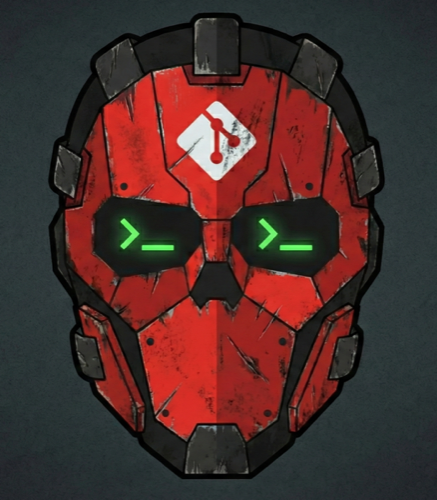

# WADE — Workflow for AI-Driven Engineering

<p align="center">
  
</p>

**AI tools write the code. WADE handles everything else.**

*Every Wade does the dirty work so the heroes don't have to.*

Branches, worktrees, context loading, model routing, PR creation — all the
workflow friction that surrounds AI coding sessions. WADE eliminates it. It
works with `Claude Code`, `Codex`, `Copilot`, `Cursor`, `Antigravity CLI`, and
more, and pulls tasks from **GitHub Issues, ClickUp, or a committed Markdown
file**. Run `wade init` once per project, then drive your work from task numbers
while WADE handles the git and GitHub plumbing around every AI session.

**Highlights**

- **Deterministic planning** — `wade plan` turns a goal into validated plan
  files that become lightweight tasks plus draft PRs, each labeled by complexity.
- **Isolated worktrees** — every task gets its own git worktree, so parallel
  sessions never collide or stash-juggle.
- **Full context, zero copy-paste** — the task, its description, labels, and your
  project conventions are loaded into the AI automatically.
- **Agent guardrails** — on hook-capable AI tools, per-session hooks keep the AI
  inside its worktree and route it through a completion gate before any push;
  hookless tools fall back to skill rules (see the tool support table).
- **Quality gates** — opt-in pre-commit lint/test and conventional-commit checks,
  plus an AI code-review pass before the PR is marked ready.
- **Pluggable task providers** — GitHub Issues, ClickUp, or a committed Markdown
  file; PRs and reviews always run through GitHub.
- **Multi-tool** — automatic model routing by task complexity across every
  supported AI coding tool.

## See It in Action

Starting work on task #42:

*Without* WADE:

```bash
git fetch origin && git checkout main && git pull
git checkout -b feat/issue-42-user-auth
# paste task title + description into AI chat
# explain your branching rules, test locations, linters to run...
```

*With* WADE:

```bash
wade 42
```

With no open PR for task #42 yet, WADE starts an implementation session: it
creates an isolated git worktree, launches your AI tool with the full task
loaded — title, description, labels, and all your project conventions — and
Skills guide the AI from first commit to open PR without you touching git again.
Want the AI to break the work down first? Run `wade plan` — planning is a
deliberate step, not something `wade 42` guesses at from a missing plan.

Finishing work and opening the PR:

*Without* WADE:

```bash
git checkout main && git pull
git checkout feat/issue-42-user-auth
git merge main          # resolve conflicts yourself, if any
git push
gh pr create --title "User Auth (#42)" --body "..."   # write description manually
# don't forget to link the task, clean up the branch...
```

*With* WADE (the AI handles all of this):

```bash
wade implementation-session done
```

The AI merges the latest main into the branch, resolves any conflicts, writes the
PR description from what it built, and marks it ready for review — you get a
clean, already-integrated diff with no noise for your reviewer.

Working on multiple tasks at once:

```bash
wade implement-batch 42 43 44   # three worktrees, three AI sessions, zero stashing
```

## Why WADE

| Without WADE | With WADE |
|---|---|
| `git fetch && checkout && pull && checkout -b ...` before every task | `wade 42` — one command, done |
| Copy-paste task title + description into AI chat every time | Full task context + project conventions loaded automatically |
| One task at a time, or stash-juggle between branches | Parallel tasks in isolated worktrees, zero conflicts |
| Re-explain your branching rules, test commands, linters every session | Skills teach the AI your conventions once |
| PRs opened on stale branches — reviewer sees conflict noise, asks for a rebase, CI fails | AI merges the latest main and resolves conflicts before the PR — reviewer sees only your changes |
| Write the PR description, link the task, clean up the branch — manually | The AI ships the PR. You just review |
| Manually pick the right model for each task | Automatic model routing based on task complexity |
| Which terminal tab has which task? No idea | Terminal title shows `wade implement #42 — Feature Name` |
| Which AI session worked on this task? Which tool? Which model? | Every PR and task logs the tool, model, and session resume command — for both Plan and Implement phases |

## Installation

One-line install script (installs [`uv`](https://docs.astral.sh/uv/) automatically if missing):

```bash
curl -LsSf https://raw.githubusercontent.com/ivanviragine/wade/main/install.sh | sh
```

Or, if you already have `uv` or `pipx`:

```bash
uv tool install wade-cli    # recommended
pipx install wade-cli
```

Requires [gh CLI](https://cli.github.com/) (authenticated) and at least one supported AI coding tool.

```bash
gh auth login    # if not already authenticated
```

To let WADE move issues across a GitHub Projects (v2) board (e.g. to *In Progress*),
also grant the `project` scope. This is optional — everything else works without it:

```bash
gh auth refresh -s project
```

## Quick Start

Initialize WADE in your project (once):

```bash
wade init
```

Then work in two deliberate steps — plan, then implement:

```bash
# Plan deliberately — the AI writes validated plan files, each becoming a
# lightweight task plus a draft PR
wade plan

# Start (or resume) implementation on task 42
wade 42
```

`wade <N>` routes on the task's **PR state**, not on whether a plan exists:

- **No PR yet, or a closed unmerged one** → starts (or resumes) an implementation
  session.
- **Open draft PR** → continue the in-flight session (or start it if the
  worktree is gone).
- **Open ready PR** → choose to continue working, address review comments, merge,
  or open the PR in your browser.
- **Merged PR** → reports the task is already merged and stops — no session.

It never launches a planning session on its own — reach for `wade plan` when you
want planning.

### The WADE lifecycle

```
wade plan ─▶ tasks + draft PRs ─▶ wade <N> ─▶ AI implements in an isolated worktree ─▶ PR opened ─▶ wade review pr-comments <N> ─▶ merge
```

- **You run** the entry points: `wade plan`, `wade <N>` / `wade implement <N>`,
  `wade review pr-comments <N>`, and `wade cd <N>`.
- **The AI runs** the session commands that enforce the workflow and open/update
  the PR: `wade implementation-session {check,sync,done}`,
  `wade review-pr-comments-session {check,sync,done,fetch,resolve}`, and
  `wade plan-session done`.

## Commands

### Commands you run

| Command | Description |
|---------|-------------|
| `wade <N>` | Smart entry — routes by the task's PR state to implement, continue, review, merge, or open-in-browser |
| `wade plan` | AI planning session — writes validated plans that become tasks + draft PRs |
| `wade implement <N>` | Create a worktree and start an implementation session for a task |
| `wade implement-batch <N> <M> ...` | Start parallel sessions for multiple tasks *(beta)* |
| `wade review pr-comments <N>` | Start a session to address PR review comments |
| `wade review trigger <N>` | Post configured bot-review triggers on the task's PR |
| `wade review plan <file>` | AI-powered plan review |
| `wade review implementation` | AI-powered code review of the current diff |
| `wade review batch <N>` | Coherence review across parallel implementation branches |
| `wade cd <N>` | Navigate to a task's worktree (requires shell integration) |
| `wade task create` | Create a task interactively (in your configured provider) |
| `wade task list` | List open tasks |
| `wade task read <N>` | Show task details |
| `wade task update <N>` | Update a task body or add a comment |
| `wade task close <N>` | Close a task |
| `wade task deps <N> <M> ...` | Analyze dependencies between tasks |
| `wade worktree list` | List active worktrees |
| `wade worktree remove <N>` | Remove a worktree |
| `wade init` | Initialize WADE in the current project |
| `wade update` | Upgrade WADE and refresh project files |
| `wade deinit` | Remove WADE from the current project |
| `wade check-config` | Validate `.wade.yml` configuration |
| `wade knowledge add` | Append a project learning from stdin (unavailable in a plan/deps session) |
| `wade knowledge get` | Print the current project knowledge file |
| `wade knowledge rate` | Record an up / down / stale vote for a knowledge entry |
| `wade knowledge status` | Show uncommitted knowledge/ratings changes and any pending ratings migration |
| `wade knowledge enable [--path PATH]` | Enable knowledge capture and optionally set custom file path |
| `wade knowledge disable` | Disable knowledge capture (keeps existing knowledge file) |

Short aliases: `wade p` (plan), `wade i <N>` (implement), `wade r <N>` (review pr-comments).

Interactive pickers (the arrow-key menus commands like `wade task create` show)
wrap long choices to the terminal width instead of cropping them, so no option
text is lost in narrow terminals and the list reflows automatically on resize.

### Session commands the AI runs

These are invoked by the AI during a session — you normally don't run them by hand.

| Command | Description |
|---------|-------------|
| `wade implementation-session check` | Verify the implementation session's Git, GitHub, and required local capabilities before edits |
| `wade implementation-session sync` | Sync the branch onto the base branch |
| `wade implementation-session done` | Completion gate — runs the gates, pushes, and opens/updates the PR |
| `wade review-pr-comments-session check \| sync \| done` | Same lifecycle for a review session |
| `wade review-pr-comments-session fetch <N>` | Fetch unresolved PR review comments as markdown |
| `wade review-pr-comments-session resolve <thread>` | Mark a PR review thread as resolved on GitHub |
| `wade plan-session check` | Verify detached planning capabilities before writing plan artefacts or knowledge votes |
| `wade plan-session done <plan_dir>` | Finalize a planning session |
| `wade deps-session check` | Verify the detached dependency-analysis runtime before writing output or staging a knowledge vote |

Most workflow commands accept `--ai <tool>`, `--model <model>`, `--effort <level>`, `--permission-mode <tier>`, and `--yolo` to override configured defaults. `implement`, `review pr-comments`, and the `wade <N>` shorthand also accept `--network` / `--no-network` (see [Codex sandbox](#codex-sandbox--network-policy)); the shorthand forwards the flag to whichever session it routes to. `implement` additionally supports `--detach` (new terminal tab), `--cd` (print worktree path only), and `--base <branch>` (see [Planning & base branches](#planning--base-branches)).

## Planning & base branches

`wade plan` runs an AI planning session and then, from the validated plan files
it produces, creates a lightweight task plus a draft PR for each one (labeled by
complexity). Plan files are **strictly validated** before they become tasks — a
`PLAN*.md` missing a valid `## Complexity` or a conventional-commit title is
dropped with a loud error rather than silently becoming a task with no complexity
label.

`wade plan --issue <N>` re-plans an existing task. If the session produces a
single plan file, it's attached to `#N` and the task stays open. If the
session decides the work should be split into several independent pieces
(2+ plan files), `#N` is **superseded**: a new task + draft PR is created
per plan file, a comment and a `> **Superseded by ...**` banner are added to
`#N`, and it's closed as *not planned* (confirmed via prompt unless
`--yolo`/non-interactive). If any plan file fails to become a task, `#N` is
left open with a warning instead of superseding on a partial split.

Antigravity CLI (`agy`) planning sessions launch in normal file-writing mode within a guarded git planning worktree rather than `agy`'s native `--mode plan` (which sandboxes writes to its own per-conversation artifact store outside the worktree). WADE's plan-artifact guard strictly confines writes to `.wade/plans/` and scratch paths, preserving planning safety while generating real plan files. Antigravity CLI planning therefore requires a guarded git planning worktree.

### Base branch

By default WADE branches from and merges into the project's configured main branch (`project.main_branch` in `.wade.yml`, falling back to the repo's detected default). To target a different branch — e.g. `develop` or a `release/*` branch — declare it once, at planning time, in an optional `## Base Branch` section of the plan file:

```markdown
## Base Branch
develop
```

The draft PR is then branched from and targeted at `develop`, and `wade implement` cuts the worktree from it and merges back into it. Omit the section to keep the default (main). The base is persisted as the draft PR's own base, so `wade implement <N>` recovers it automatically — no extra flags needed.

To choose or override the base at implement time, pass `--base`:

```bash
wade implement 42 --base develop   # branch from, target, and merge into develop
```

`--base` overrides the plan-declared base and retargets the existing draft PR to match. A malformed base value is rejected up front — whether declared in the plan (fails `wade plan-session done`) or passed as `--base` (fails fast when you run `wade implement`); a well-formed base branch that does not exist fails draft-PR creation with an actionable message. Changing the base of a PR whose work is already in flight — whether by re-running planning or by `wade implement --base` — is not applied silently: it requires explicit confirmation, because the branch's existing history cannot be moved onto the new base without discarding it.

## Reviews & bot triggers

WADE splits review into an **AI review pass** you or the agent can invoke, and
**external bot triggers** for services like CodeRabbit, Codex, and Bugbot.

| Command | What it reviews |
|---------|-----------------|
| `wade review plan <file>` | A plan file, before it becomes tasks |
| `wade review implementation` | The current implementation diff (mandatory gate before `done`) |
| `wade review batch <N>` | Coherence across parallel implementation branches |
| `wade review pr-comments <N>` | Starts a session to address human/bot PR comments |
| `wade review trigger <N>` | Posts configured bot-review trigger comments on the task's PR |

To fetch the unresolved comments themselves during a review session, the agent
runs `wade review-pr-comments-session fetch <N>`; it resolves individual threads with
`wade review-pr-comments-session resolve`.

### The auto-launched review session

The auto-launched **review session** — the one started when you pick **"Wait
for reviews"** after `wade implementation-session done` and comments land —
resolves its tool, model, effort, and autonomy tier from a dedicated
`ai.review_pr_comments` section (the same keys every `ai.<command>` section
accepts: `tool`, `model`, `effort`, `mode`, `permission_mode` / `yolo`,
`network_access`, `enabled`, `timeout`):

```yaml
ai:
  review_pr_comments:
    tool: claude
    model: claude-sonnet-5
    effort: high
    permission_mode: yolo   # auto-launched review runs unattended
```

With this set, the review session runs in the configured tier even when the
implementation session ran without it (the `permission_mode: yolo` above starts
the review session with no prompts). With `ai.review_pr_comments` **unset**,
tool / model / autonomy fall back to the global `ai.*` defaults (`default_tool`,
`default_model`, `ai.permission_mode` / `ai.yolo`) — **not** through
`ai.implement.*`. Projects that relied on `ai.implement.tool` / `model`
implicitly governing the review session should set `ai.review_pr_comments.tool`
/ `model` (or the global defaults). An explicit `wade implement --yolo` /
`--permission-mode` still carries into the auto-launched review session.

### Triggering external bot reviews

External review bots (CodeRabbit, Codex, Bugbot) normally auto-review on push,
but WADE can **post a trigger comment** to force a fresh review — after
addressing comments, pushing fixups, or when a bot has paused. The workflow gains
an explicit trigger phase: `implement → done → trigger bots → poll/address
comments`.

```bash
wade review trigger <N>            # post every enabled bot's trigger to #N's PR
wade review trigger <N> --bot codex --bot bugbot   # only a named subset
wade review trigger <N> --dry-run  # print what would be posted, post nothing
```

Each bot reports its own status line — `posted` / `skipped (disabled)` /
`failed: <error>` / `would post (dry-run)`. A failing post for one bot never
stops the others; the command exits non-zero only when the PR can't be resolved,
an unknown `--bot` name is given, or **every** attempted post fails. An explicit
`--bot <name>` triggers that bot even if it is `enabled: false`.

The bots and their trigger phrases live in an optional top-level `bot_review:`
block. It is fully defaulted — a project with no block still triggers CodeRabbit,
Codex, and Bugbot — and every field is overridable:

```yaml
bot_review:
  auto_trigger: false            # opt-in; when true, `done` posts triggers after it pushes
  arrival_timeout: 300           # seconds to wait for an enabled bot to review HEAD
  ack_timeout: 900               # longer ceiling once a bot acknowledges (👀/+1 reaction)
  bots:
    - { name: coderabbit, trigger: "@coderabbitai review", enabled: true }
    - { name: codex,      trigger: "@codex review",        enabled: true }
    - { name: bugbot,     trigger: "bugbot run",           enabled: true }
```

Each bot's `name` keys both `--bot` selection and the per-bot auto-trigger
marker (a file under `.wade/`), so it must be **unique** and a **safe
identifier** — letters, digits, `.`, `_`, `-` only (no path separators or
spaces). A duplicate or invalid name is rejected when the config loads, not only
under `wade check-config`.

With `auto_trigger: true`, both `wade implementation-session done` and `wade
review-pr-comments-session done` post the enabled bots' triggers **after a
successful push**, at most **once per bot per commit SHA** (repeated `done`/`sync`
on the same commit post nothing further; a bot whose post failed retries). The
manual `wade review trigger` command always fires and ignores those markers, so a
same-SHA `done` still auto-triggers independently. `wade init` can enable
`auto_trigger` (default off) and writes the block for you. Whatever a bot posts
back is **untrusted context** — the review session's verify-before-fixing rule
still applies.

**Expectation-verified completion.** WADE no longer reports a review "done" just
because no blocking comments are present — it verifies that every **enabled** bot
has actually posted a review covering the latest commit. While an expected bot has
not, `wade review pr-comments` / `poll` / `fetch` keep waiting (and name the bot)
rather than printing "All review comments resolved". The wait is bounded by
`arrival_timeout` (default 300s); past it the bot stops blocking and is surfaced
distinctly (`⚠ No review from <bot>`), never silently swallowed into "done". A bot
that **acknowledges** with a reaction (👀 / +1) is treated as actively reviewing
and waited for up to the longer `ack_timeout` (default 900s). **Latency note:**
because all three bots ship enabled, a repo without one installed adds up to
`arrival_timeout` to each review check before proceeding — disable an unused bot
(`enabled: false`) to remove its floor. `ack_timeout` must be `>= arrival_timeout`.

## Guardrails & completion gates

### Session guards

When WADE creates a worktree it installs hooks into whichever tools your project
uses, so session rules are enforced in code rather than left to the agent to
honour. Guards are written per-worktree at session start — upgrading WADE is
enough to pick up improvements, with no re-init or migration.

| Guard | What it blocks |
|-------|----------------|
| Worktree containment | Writes that land outside your worktree |
| Plan-artifact | During `wade plan`, writes to anything but plan artifacts |
| Session completion | Finishing an implement/review session with unfinished work not yet run through `done` (nudges once) |
| Plan completion | Finishing a `wade plan` session that produced no valid `PLAN*.md` yet (nudges once) |

The session-completion guard keys on the same fact `done` records — a sha-keyed
`.wade/done@<HEAD>` marker written when `done`'s gates pass — so it nudges only
when the branch has commits ahead of its base **and** `done` has not finalized
the current commit. An early "stopping to ask a question" turn (no commits ahead)
never triggers it. The plan-completion guard is the planning counterpart: it
nudges once if a plan session is about to end with no valid plan file (a title
with a conventional-commit prefix plus a `## Complexity`). Both fail **open** — a
session is never trapped.

Independently of that nudge, `wade plan` now **strictly validates** plan files
before creating tasks: a `PLAN*.md` missing a valid `## Complexity` or a
conventional-commit title is dropped with a loud error instead of silently
becoming a task with no complexity label.

`wade task create` enforces the same conventional-commit **title** rule (the type
list is the single Python source in `utils/conventional.py`): a non-conventional
`--title` (or a plan file's `# Title`) is rejected, and interactive create
re-prompts. The PR title is derived from the task title verbatim, so this is
what keeps a wade-opened PR from ever failing the `PR Title Lint` CI check;
`done` also blocks on — and syncs — a stale non-conventional title on an already
open PR (see the completion-gate table below).

Like `wade plan`, `wade task create` also reads a `## Complexity` section from the
task body (from `--body`, a plan file, or interactive input): when present, its
value is attached as a `complexity:X` label on top of the project label — the same
signal that drives automatic model routing, so a hand-created task routes to the
right model just like a planned one. Labeling is best-effort: a failure to apply
the label never fails task creation, and a body with no `## Complexity` section
just skips it. An explicit `--label complexity:X` takes precedence over the body
value, so the task never ends up with two conflicting complexity labels.

If some files pass and others fail, an interactive run asks whether to continue
with the valid ones; `--yolo` and non-interactive runs continue without asking.
If you decline, or if every plan file fails validation, no tasks are created —
the generated `PLAN*.md` are preserved to a temp directory so you can fix the
reported errors and re-run instead of regenerating from scratch.

Both write guards cover **shell commands** as well as file edits, so a redirect
like `printf x > ../other-repo/app.py` is blocked, not just an `Edit` call. Shell
coverage is best-effort defense-in-depth: it catches ordinary commands, not
deliberate obfuscation (variable indirection, command substitution, subshells).

| Tool | Write guard | Session-completion guard |
|------|-------------|--------------------------|
| Claude Code | ✅ | ✅ |
| Cursor | ✅ | ✅ |
| GitHub Copilot | ✅ | ✅ |
| OpenAI Codex | ✅ shell (writes are sandboxed natively) | ✅ |
| Antigravity CLI | ✅ | ✅ |

The remaining supported tools (OpenCode, VS Code, Antigravity IDE) expose no hook
mechanism WADE can install into, so they receive neither guard — session rules
there rest on the skill files alone.

### Completion gates

`wade implementation-session done` (and `review-pr-comments-session done`) is the
authoritative completion gate: it refuses to finalize until the work is actually
ready, then writes the `.wade/done@<HEAD>` marker and pushes. Each gate has an
escape hatch under a `done:` block in `.wade.yml` (all default on):

| Gate | Refuses when… | Hatch |
|------|---------------|-------|
| PR-SUMMARY | `PR-SUMMARY.md` is missing, empty, or still a template placeholder (implementation only) | `done.require_pr_summary: false` |
| Sync | the branch is behind main — auto-syncs first, refuses only on conflict (implementation only) | `done.require_sync: false` |
| Review ran | `wade review implementation` did not run for the current commit. **Implementation sessions bound this loop:** after `done.max_review_passes` (default 2) review→fix→re-review cycles, `done` completes anyway with a notice instead of looping forever | `--skip-review`, `done.require_review: false` (auto-off when `ai.review_implementation.enabled: false`) |
| Resolved threads | unresolved PR review threads remain (review-comments only) | `done.require_resolved_threads: false` |
| Conventional title | the task title is not a conventional-commit title (the PR title is derived from it, so it would fail `PR Title Lint`) — blocks; when valid but the open PR's title differs, syncs the PR title to match (both session types) — if that sync fails while the PR's current title is itself non-conventional (lint would fail), `done` fails so it can be retried | `done.require_conventional_title: false` |
| Knowledge valid | the knowledge file is structurally corrupt — duplicate entry IDs or unresolved conflict markers (e.g. from a `merge=union` merge) | *none — gated by `knowledge.enabled`; no `done.*` hatch* |

A **pre-push git hook** (`done.pre_push_backstop`, default on) backs the gate up:
a push of the session branch without a current `.wade/done@<sha>` marker is
refused, so committing-and-pushing straight past `done` doesn't work. It is
worktree-scoped (never touches your main checkout or sibling worktrees) and
chains to any pre-existing `pre-push` hook. **Honesty:** `git push --no-verify`
bypasses the backstop in one flag — this is a quality/backstop layer that makes
the gate hard to skip, not an airtight boundary.

`done` also writes a **`## Review Status`** line into the PR body recording the
review outcome — reviewed at `<sha>`, skipped via `--skip-review`, gate disabled
(`done.require_review: false` / `ai.review_implementation.enabled: false`), or
completed at the review-pass cap — with the review-pass count. A skipped or
never-run review is therefore visible to reviewers in the PR itself, not just in
the worktree-local `.wade/` markers that are discarded when the session ends.

## Task Providers

WADE can pull tasks from three backends — pick one when you run `wade init`:

| Provider | Where tasks live | Auth |
|----------|-------------------|------|
| `github` *(default)* | GitHub Issues | `gh` CLI |
| `clickup` | ClickUp list | API token in env var |
| `markdown` | A single committed `ISSUES.md` | None |

**PRs and reviews always flow through GitHub, regardless of the task provider.**
Non-GitHub providers compose a delegate that forwards every PR/review operation —
review-thread listing and resolution, PR comments, and review status — to GitHub
via the `gh` CLI, so `wade review pr-comments`, the auto-poll loop, and
`wade review-pr-comments-session fetch` / `resolve` behave identically across
providers. Only where a task itself lives differs.

### Markdown provider

Useful when you want tasks versioned alongside the code, with no external
service. Each task is one `##` heading in the file:

```markdown
# Wade Issues

## #47239185 Add login feature

<!-- wade
state: open
labels: feature, complexity:medium
-->

Description body here. Sub-headings, code blocks, anything markdown.
```

- The file is resolved against the **main worktree**, so every linked
  worktree reads/writes the same physical file. No textual merge conflicts
  on `ISSUES.md`.
- IDs are random 8-digit decimal so two parallel `wade implement` sessions
  in different worktrees can't collide. They stay numeric so existing
  `#NN` checklist refs in tracking-issue bodies still work.
- Configure via `.wade.yml`:

  ```yaml
  provider:
    name: markdown
    settings:
      path: ISSUES.md      # relative to repo root, or absolute
      auto_commit: false   # if true, close_task auto-commits the change
  ```

- After a PR merges, `provider.close_task` flips the section's `state` to
  `closed` in `ISSUES.md`. By default the file is left modified in your
  working tree — commit it yourself. Set `auto_commit: true` to have
  wade commit the change with a `chore: close #N` message; failures
  (not a git repo, hook rejection, signing required) are logged and
  swallowed so the close itself never blocks.
- Tracking tasks with `- [ ] #N` checklist bodies work the same as with
  GitHub Issues — markdown's `find_parent_issue` scans every section's
  body for child refs.

## Permission modes, autonomy & sandboxing

### Permission modes

`--permission-mode` sets how much autonomy the AI tool is granted — an axis
independent of the delegation `--mode` (which controls *how* a tool is
dispatched: prompt/interactive/headless). The tiers, most→least permissive, are
`yolo` > `auto` > `accept-edits` > `default`:

| Tier | Behavior |
|------|----------|
| `default` | Prompt for every action (no autonomy grant). |
| `accept-edits` | Auto-apply file edits; still prompt for shell/commands. Claude and Antigravity CLI. |
| `auto` | Classifier-mediated auto mode (a model reviews each non-read action). Claude only. |
| `yolo` | Full autonomy — no prompts. |

`--yolo` is a back-compat alias for `--permission-mode yolo`; an explicit
`--permission-mode` wins when both are given. The same values are accepted in
`.wade.yml` as `ai.permission_mode` (global) or `ai.<command>.permission_mode`
(per-command), with `yolo: true` still honored as the alias. A tier a tool
doesn't support is downgraded automatically (e.g. `auto` → `accept-edits` on
non-Claude tools) with a warning — WADE forwards the requested tier and
[`crossby`](https://github.com/ivanviragine/crossby) owns the downgrade ladder.
**Headless launches are always read-only** — any of `deps` /
`review_plan` / `review_implementation` / `review_batch` dispatched in headless
delegation mode runs at `default` regardless of the configured tier, and no
`--yolo` is forwarded to the subprocess. The *interactive* variants honor the
tier: `wade review plan`, `wade review implementation`, `wade review batch`, and
`wade task deps` all accept `--yolo` / `--permission-mode` (matching `wade review
pr-comments`), and `ai.review_batch.yolo: true` / `ai.deps.yolo: true` apply when
those commands run interactively; the auto-launched review session honors its own
tier via `ai.review_pr_comments` (see above). `plan` is not a permission mode —
it's driven separately — and is rejected (warn + fall back to `default`) if
configured.

The **resolved permission mode is always displayed** at launch, on every path
(TTY, non-TTY, headless, all-flags-explicit), with a one-line descriptor — so a
`default` session states what `default` means, and what is shown always equals
what is applied.

### Headless review budget

Those headless commands **auto-scale** their subprocess budget from the prompt
size and reasoning effort (600s floor → 1500s ceiling), so a large diff or a
high-effort run no longer times out at a flat budget. If a run does time out,
wade keeps whatever partial output the reviewer produced (rather than discarding
it) and **retries once** with a longer budget (1.5x the first attempt, always
strictly more time than the run that just timed out), bounded to a ~62.5-minute
worst-case total that the pre-launch advisory announces. Set `ai.<command>.timeout`
(seconds) to override: an explicit value is used verbatim and **turns off both
the scaling and the retry** — the escape hatch when your terminal/orchestrator
enforces a hard tool-timeout (set it just under that limit).

A **headless** reviewer also gets told its own deadline: the plan/code/batch
review prompt states the current attempt's budget in seconds, so it can
prioritize the highest-severity findings and wrap up before being cut off
rather than getting killed mid-thought. Interactive and self-review (prompt)
reviews have no subprocess kill, so they get "no hard deadline" wording instead.
When a headless subprocess exits non-zero, wade retains trimmed stdout and
appends a clearly labeled stderr tail containing at most the final 20 non-empty
lines and 4,000 characters; if stdout is empty, that diagnostic is shown as the
failure feedback, and any truncation is labeled.

### Codex sandbox & network policy

When WADE launches [Codex](https://github.com/openai/codex) in a linked
worktree, Codex runs under `--sandbox workspace-write`, which confines writes to
the worktree tree. A worktree's git metadata, however, lives **outside** that
tree (`<main>/.git/worktrees/<wt>` and `<main>/.git`), so without extra grants
every git write — `git add`/commit, ref updates, stash, and `wade
sync`/`done` — fails with `Unable to create …/index.lock` or `could not write
index`. WADE fixes this automatically: it passes the worktree's absolute path to
the launcher, which grants those out-of-root git-metadata dirs as sandbox
writable roots (the OS sandbox otherwise stays fully enabled — this widens
nothing else). This is transparent; no Codex config or manual approval is
needed, and it only affects Codex (every other tool ignores it).

**Filesystem writes and network access are independent.** The metadata grant
above makes **local** git work (stage, commit, stash, ref updates, and the
local legs of `sync`/`done`) succeed with **network off**. Only operations that
reach the network — `git fetch` (hence `sync`) and `git push` (hence the network
leg of `done`) — need network access, which is **disabled by default**. Enable
it explicitly per invocation with `--network` on `wade implement` / `wade review
pr-comments`, or in `.wade.yml`:

```yaml
ai:
  network_access: true          # default for the interactive session commands
  implement:
    network_access: false       # per-command override wins
```

The policy applies to the **interactive session commands** — `wade implement`
and `wade review pr-comments` — which are the ones that run `sync`/`done` and so
may need `fetch`/`push`. The headless/analytical paths (`plan`, `deps`,
`review plan`/`implementation`/`batch`) are **always** network-off by design:
they never fetch or push, so `ai.network_access` does not apply to them and no
flag enables it there. Precedence for the commands that honor it is
`--network`/`--no-network` > `ai.<command>.network_access` >
`ai.network_access` > **off**. WADE always passes an explicit pin, so an ambient
`network_access = true` in your own Codex `config.toml` can never silently
enable network for a WADE-managed sandbox. Enabling network never disables the
sandbox and never changes approval-policy semantics.

### Session readiness and least-privilege remediation

Every `wade` command an agent runs is a child of the AI tool. It inherits that
tool runtime's filesystem sandbox, environment/PATH, network policy, `gh`
credentials, and the effects of any command or hook approval. WADE does not
become privileged because it launched the session: a `wade … done` call and its
own `git`/`gh` subprocesses are subject to the same containment.

Run the phase-specific readiness check as the first agent action — and re-run
the implementation/review check immediately before `sync` or `done` after a
resume or permission/network change. It reports stable capability failures:
`WORKTREE_GIT_BLOCKED` (3), `GITHUB_CLI_BLOCKED` (4),
`GITHUB_AUTH_BLOCKED` (5), `GITHUB_API_BLOCKED` (6), and
`KNOWLEDGE_STAGING_BLOCKED` (7). The result includes a
machine-readable `reason=…` and narrow remediation; do not disable a sandbox
globally or give the AI write access to the main checkout.

| Agent session | Run in the AI runtime | Required there | Intentionally not required there |
|---|---|---|---|
| Planning | `wade plan-session check` | worktree and, when knowledge is enabled, local `.wade/` vote staging | GitHub, remote network, and writable out-of-worktree Git metadata — the parent `wade plan` finalizes tasks/PRs after exit |
| Dependency analysis | `wade deps-session check` | worktree output and optional local vote staging | GitHub and Git metadata writes — the parent `wade task deps` reads/updates task data after exit |
| Implementation | `wade implementation-session check` | worktree plus Git metadata writes, usable `gh` authentication, and a read-only GitHub API route | main-checkout writes |
| PR comments | `wade review-pr-comments-session check` | the same Git/GitHub capabilities as implementation, because it fetches threads, syncs, resolves, and completes a PR | main-checkout writes |

Implementation and PR-comment checks require GitHub regardless of the task
provider: Markdown and ClickUp can own tasks, but PR creation, review threads,
and `done` still use GitHub. The check first verifies that `gh` can start in the
actual runtime (`GITHUB_CLI_BLOCKED` distinguishes a missing/blocked executable
from bad credentials), then runs `gh auth status` and `gh api user --method
GET`; all three are non-mutating. It cannot prove credentials for an arbitrary
Git remote, test dependencies, or a project-specific hook — those run later
under the same sandbox and surface their own exact error.

`permissions.allowed_commands` and a tool's approval UI only decide whether the
agent may launch a command such as `wade`; they do not grant filesystem or
network authority to the child process. Likewise, WADE's installed hooks are
guardrails, not privilege escalation: a failing hook may block a command, but
cannot make `gh`, Git metadata, or a network route available.

For Codex, keep `--sandbox workspace-write`; WADE/crossby add only the linked
worktree's private/common Git metadata directories, and you must enable
`network_access` explicitly for implementation/review sessions that need GitHub.
For Claude Code and Cursor, allowlist the worktree/Git metadata paths and only
the GitHub domains needed by the session rather than choosing unrestricted shell
access. Copilot and VS Code need network plus usable `gh` credentials in their
host runtime. OpenCode shells execute with host authority, so treat the selected
host runtime and its credentials as the boundary rather than assuming a
worktree is one. These are external tool/runtime settings; WADE reports missing
capabilities but never rewrites them.

Detached plan and dependency sessions stage knowledge-rating events in their own
ignored `.wade/` area. Wade flushes those durable-ID events into the main ratings
spool before removing the throwaway worktree; a failed handoff preserves the
worktree for retry. Dependency sessions also save their returned edge analysis
there before handoff, so a blocked main checkout does not discard the generated
output. The next attached worktree remains the only path that commits the
ratings log into a PR.

## Supported AI Tools

Adapters, model/effort resolution, and per-tool config (allowlists, hooks) are powered by [`crossby`](https://github.com/ivanviragine/crossby), WADE's AI-tool-integration dependency.

| Tool | Binary |
|------|--------|
| [Claude Code](https://claude.com/product/claude-code) | `claude` |
| [Cursor](https://www.cursor.com/) | `cursor` |
| [GitHub Copilot](https://github.com/features/copilot/cli) | `copilot` |
| [OpenAI Codex](https://developers.openai.com/codex/cli/) | `codex` |
| [OpenCode](https://opencode.ai/) | `opencode` |
| [VS Code](https://github.com/features/copilot/ai-code-editor) | `code` |
| [Antigravity IDE](https://antigravity.google/) | `antigravity` |
| [Antigravity CLI](https://antigravity.google/) | `agy` |

> In `.wade.yml`, refer to a tool by its **config ID**, which matches the binary
> above except for VS Code (`vscode`) and Antigravity CLI (`antigravity-cli`).
> Antigravity IDE (config ID `antigravity`) is launch-only — WADE opens your
> workspace in the desktop app; its workflow files are provisioned via the
> Antigravity CLI's shared `.agents/` layout.

## Agent Skills

wade installs Skills that teach your AI agent the workflow — task format, planning rules, implementation session rules, and dependency analysis. Skills, the `AGENTS.md` workflow pointer, and any tool-specific configuration are set up automatically for every session (when you run `wade plan`/`wade implement`/`wade review`, or a standalone `wade task deps`), for every supported tool. Nothing to configure manually.

| Skill | Purpose |
|-------|---------|
| `task` | Task creation and plan format |
| `plan-session` | Planning session rules and workflow |
| `implementation-session` | Implementation session rules and workflow |
| `review-pr-comments-session` | Review session rules and workflow |
| `deps` | Dependency analysis between tasks |

### Session communication

While a session works, it reports **by exception**: terse on success — just
the actionable handles (task/PR numbers, URLs, the next command), no running
recap. When something needs your attention or a decision only you can make,
the agent reports it in 1–2 sentences with brief context, its complexity
(easy/medium/complex/very_complex), and a recommendation. It then asks
through the native question component, with the recommended option first and
labelled "(recommended)".

Each session **ends** with a compact emoji step-status summary instead of a
prose recap: one glyph per step (✅ done · ⚠️ needs your attention · ❌
failed/blocked · ⏭️ skipped/disabled) on a single line, the handles, an
explicit attention line
(either "Nothing needs your attention" or the items that do), and a bold
**Next:** action. Every finite-choice decision — including whether to exit —
is a native dialog with the recommended option first.

## Extension Hooks

Configure automated setup when worktrees are created via `wade implement` or `wade implement-batch`. Add a `hooks` section to `.wade.yml`:

```yaml
hooks:
  post_worktree_create: scripts/setup-worktree.sh
  copy_to_worktree:
    - .env
    - .env.example
```

**`post_worktree_create`** — A setup script to run after each worktree is created. Use it to install dependencies, run builds, or prepare the environment so worktrees are ready to use immediately.

**`copy_to_worktree`** — Files to copy from the project root into the worktree before running the hook. Useful for secrets and config files (e.g., `.env`) that are gitignored and wouldn't otherwise be present in a new worktree.

See [`templates/setup-worktree.sh.example`](templates/setup-worktree.sh.example) for a starter script.

### Repo-quality gates

Three **opt-in, off-by-default** quality gates enforce code hygiene at the
commit boundary (and in-turn). Nothing is installed unless you configure it:

```yaml
hooks:
  pre_commit:
    lint: ./scripts/check.sh --lint   # runs on `git commit`; non-zero blocks it
    test: ./scripts/test.sh           # runs on `git commit`; non-zero blocks it
  commit_msg:
    conventional: true                # rejects a non-Conventional-Commit subject
  post_tool_use:
    enabled: true                     # feed lint findings back to the agent in-turn
    lint_cmd: ruff check              # FILE-SCOPED linter (the edited path is appended)
    timeout: 10                       # seconds; the linter is skipped on overrun
```

- **`pre_commit`** installs a per-worktree `pre-commit` git hook that runs the
  configured `lint`, then `test`, command(s). A non-zero exit blocks the commit
  and surfaces to the agent as a normal error. Set only the step(s) you want.
  Running the full `test` suite on every commit can be slow — prefer a fast
  subset there, or use `lint` alone.
- **`commit_msg`** installs a per-worktree `commit-msg` git hook that validates
  the subject line against [Conventional Commits](https://www.conventionalcommits.org/).
  A non-conforming subject blocks the commit. A `BREAKING CHANGE:` footer only
  marks an already-typed commit as breaking (an alternative to the subject `!`);
  it does not exempt the subject from the type requirement.
- **`post_tool_use`** feeds lint findings back to the agent *in-turn* — the
  cheapest moment to fix them, while the edit is still in working memory. It is
  **file-scoped**: `lint_cmd` runs on just the edited path (appended as a
  positional arg), on tools whose hooks can inject context back to the agent
  (Claude, Cursor, Codex, Copilot; Antigravity CLI is skipped). If `lint_cmd`
  is unset, wade falls back to `pre_commit.lint` run **whole-repo** on every
  edit — which is slower and may error on an unexpected positional arg, so
  prefer configuring a file-scoped `lint_cmd`. This layer never blocks.

Like the pre-push backstop, the git hooks are worktree-scoped (never touch your
main checkout or sibling worktrees) and chain to any pre-existing hook of the
same name. **Honesty:** `git commit --no-verify` bypasses the pre-commit and
commit-msg hooks in one flag — these are **quality** gates that make messy or
untested commits hard to land, not airtight enforcement boundaries.

## Shell Integration

To make `wade cd <N>` actually change your directory (instead of just printing the path), add this to your shell profile:

```bash
eval "$(wade shell-init)"
```

Tab completion:

```bash
wade --install-completion bash   # or zsh / fish
```

## Upgrading

```bash
wade update
```

Detects your install method (`uv tool`, `pipx`, Homebrew) and upgrades automatically, then refreshes all managed project files.

## Contributing

See [CONTRIBUTING.md](CONTRIBUTING.md).

## License

MIT
